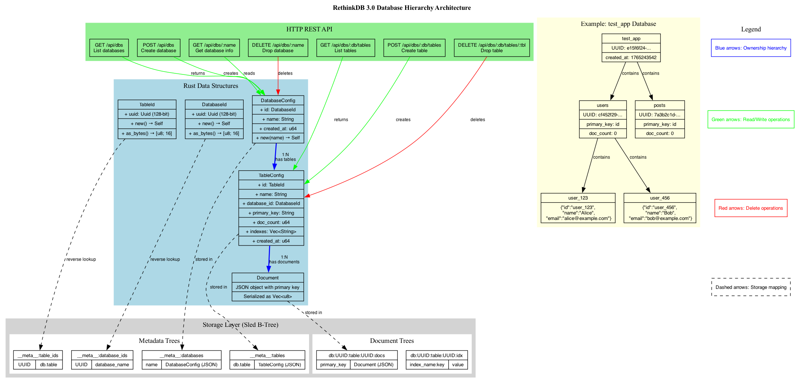
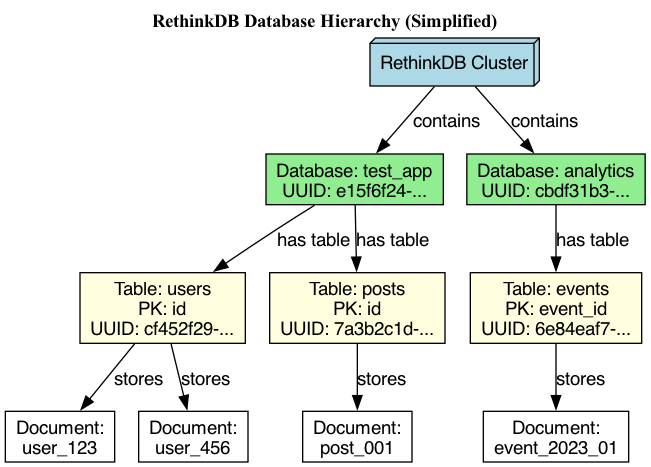
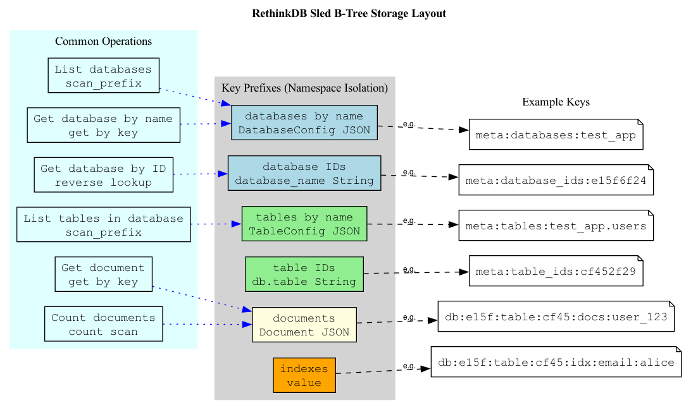

# PhotonDB Architecture Visualizations

This directory contains Graphviz diagrams that visualize the PhotonDB database hierarchy and storage architecture.

## Diagrams

### 1. Database Hierarchy (Complete)

**File:** `database_hierarchy.dot` → `database_hierarchy.png` / `database_hierarchy.svg`

Complete architecture diagram showing:

- Storage Layer (Sled B-Tree with key prefixes)
- Rust Data Structures (DatabaseConfig, TableConfig, IDs)
- HTTP REST API endpoints
- Example data flow
- Relationships and operations



**Best for:** Understanding the complete system architecture

---

### 2. Database Hierarchy (Simplified)

**File:** `database_hierarchy_simple.dot` → `database_hierarchy_simple.png` / `database_hierarchy_simple.svg`

Simplified hierarchy showing:

- Cluster → Databases → Tables → Documents
- Example with `test_app` and `analytics` databases
- Clear parent-child relationships



**Best for:** Quick overview and presentations

---

### 3. Storage Layout

**File:** `storage_layout.dot` → `storage_layout.png` / `storage_layout.svg`

Detailed storage structure showing:

- Sled B-Tree key prefixes
- Metadata storage format
- Document storage format
- Common operations (scan, get, count)
- Example keys



**Best for:** Understanding storage implementation

---

## Compiling Diagrams

To regenerate the diagrams after editing the `.dot` files:

```bash
# Generate PNG (raster images)
dot -Tpng database_hierarchy.dot -o database_hierarchy.png
dot -Tpng database_hierarchy_simple.dot -o database_hierarchy_simple.png
dot -Tpng storage_layout.dot -o storage_layout.png

# Generate SVG (vector images - better for scaling)
dot -Tsvg database_hierarchy.dot -o database_hierarchy.svg
dot -Tsvg database_hierarchy_simple.dot -o database_hierarchy_simple.svg
dot -Tsvg storage_layout.dot -o storage_layout.svg

# Generate PDF
dot -Tpdf database_hierarchy.dot -o database_hierarchy.pdf
```

### Install Graphviz

**macOS:**

```bash
brew install graphviz
```

**Ubuntu/Debian:**

```bash
sudo apt-get install graphviz
```

**Windows:**
Download from https://graphviz.org/download/

---

## Legend

### Node Colors

- **Light Blue**: Database-related types and metadata
- **Light Green**: Table-related types and metadata
- **Light Yellow**: Document storage
- **Orange**: Index storage
- **Light Cyan**: Operations

### Arrow Colors

- **Blue**: Ownership hierarchy (1:N relationships)
- **Green**: Read/Write operations
- **Red**: Delete operations
- **Dashed**: Storage mapping

### Arrow Styles

- **Solid**: Direct relationships
- **Dashed**: Storage/mapping relationships
- **Dotted**: Operation to storage relationships

---

## Storage Key Examples

### Metadata Keys

```
__meta__:databases:test_app              → DatabaseConfig (JSON)
__meta__:database_ids:e15f6f24-...       → "test_app"
__meta__:tables:test_app.users           → TableConfig (JSON)
__meta__:table_ids:cf452f29-...          → "test_app.users"
```

### Document Keys

```
db:e15f6f24...:table:cf452f29...:docs:user_123
→ {"id":"user_123", "name":"Alice", "email":"alice@example.com"}
```

### Index Keys

```
db:e15f6f24...:table:cf452f29...:idx:email:alice@example.com
→ "user_123"  (points to document primary key)
```

---

## Architecture Highlights

### Hierarchical Structure

```
Cluster
  ├─ Database: test_app (UUID: e15f6f24-...)
  │   ├─ Table: users (UUID: cf452f29-..., PK: id)
  │   │   ├─ Document: user_123
  │   │   └─ Document: user_456
  │   └─ Table: posts (UUID: 7a3b2c1d-..., PK: id)
  │       └─ Document: post_001
  └─ Database: analytics (UUID: cbdf31b3-...)
      └─ Table: events (UUID: 6e84eaf7-..., PK: event_id)
          └─ Document: event_2023_01
```

### REST API Endpoints

```
GET    /api/dbs                        - List all databases
POST   /api/dbs                        - Create database
GET    /api/dbs/:name                  - Get database info
DELETE /api/dbs/:name                  - Drop database

GET    /api/dbs/:db/tables             - List tables in database
POST   /api/dbs/:db/tables             - Create table
DELETE /api/dbs/:db/tables/:table      - Drop table
```

### Storage Operations

| Operation      | Method                                                                     | Example                     |
| -------------- | -------------------------------------------------------------------------- | --------------------------- |
| List databases | `scan_prefix("__meta__:databases:")`                                       | Returns all DatabaseConfigs |
| Get database   | `get("__meta__:databases:test_app")`                                       | Returns DatabaseConfig      |
| Get by ID      | `get("__meta__:database_ids:{uuid}")` → `get("__meta__:databases:{name}")` | Two-step lookup             |
| List tables    | `scan_prefix("__meta__:tables:test_app.")`                                 | Returns all TableConfigs    |
| Count docs     | `count(scan_prefix("db:{uuid}:table:{uuid}:docs:"))`                       | Count all documents         |

---

## Comparison with Original C++ Implementation

| Component   | C++                | Rust               |
| ----------- | ------------------ | ------------------ |
| Database ID | `uuid_u`           | `DatabaseId(Uuid)` |
| Table ID    | `namespace_id_t`   | `TableId(Uuid)`    |
| Storage     | Custom B-Tree      | Sled B-Tree        |
| API         | JavaScript/Node.js | Rust/Axum          |

---

## See Also

- [Database Hierarchy Documentation](database_hierarchy.md)
- [Storage Engine](../../src/storage/README.md)
- [HTTP API Reference](../api/http.md)
